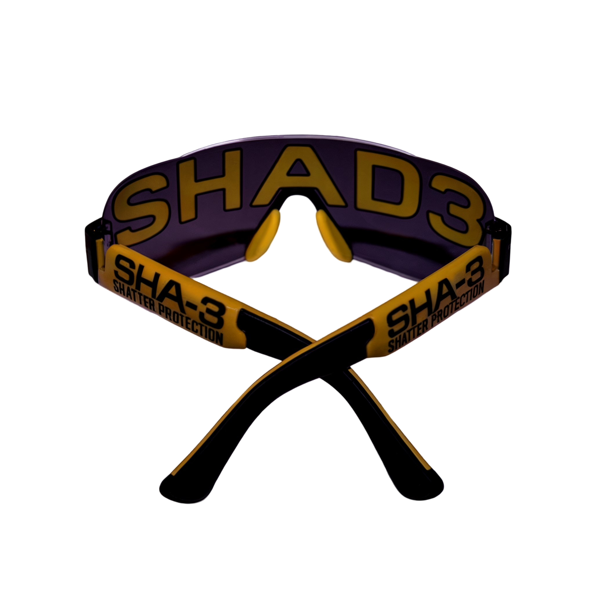

# SHAD3



SHAD3 is an application using SHA3-512 to hash entries in a list or multiple lists, typically those made for Pi-hole. This is designed for [SHATTER](https://addons.mozilla.org/en-US/firefox/addon/shatt3r/) and similar applications or addons. Ideally, it serves to maintain the confidentiality of blocked content, which may include exploitative or abusive websites.

## Example Usage
```bash
shad3 <blocklist-url-or-path> [output-path]
```

## Installation Options with Architecture Detection

### Binary Installation (Recommended)
Pre-built binaries are available in the [releases](https://github.com/styromaniac/shad3/releases) section. The following one-liners automatically detect the CPU architecture and download the correct binary:

#### Linux Binary
```bash
ARCH=$(uname -m) && case $ARCH in   'x86_64') BIN=shad3-linux_x86_64.tar.gz ;;   'aarch64') BIN=shad3-linux_aarch64.tar.gz ;;   *) echo "Unsupported architecture: $ARCH" && exit 1 ;; esac && curl -LO https://github.com/styromaniac/shad3/releases/latest/download/$BIN && tar -xzf $BIN && chmod +x shad3 && sudo mv shad3 /usr/local/bin && rm -rf $BIN
```

#### macOS Binary
```bash
ARCH=$(uname -m) && case $ARCH in   'x86_64') BIN=shad3-macos_x86_64.tar.gz ;;   'aarch64') BIN=shad3-macos_aarch64.tar.gz ;;   *) echo "Unsupported architecture: $ARCH" && exit 1 ;; esac && curl -LO https://github.com/styromaniac/shad3/releases/latest/download/$BIN && tar -xzf $BIN && chmod +x shad3 && sudo mv shad3 /usr/local/bin && rm -rf $BIN
```

#### Windows Binary (PowerShell)
```powershell
$ARCH = (Get-WmiObject Win32_Processor).Architecture
if ($ARCH -eq 9) { 
    $BIN = 'shad3-windows_x86_64.zip' 
} elseif ($ARCH -eq 5) { 
    $BIN = 'shad3-windows_aarch64.zip' 
} else { 
    Write-Host "Unsupported architecture: $ARCH" -ForegroundColor Red
    exit 
}
Invoke-WebRequest -Uri "https://github.com/styromaniac/shad3/releases/latest/download/$BIN" -OutFile $BIN
Expand-Archive -Path $BIN -DestinationPath .
Move-Item -Path .\shad3.exe -Destination "$env:ProgramFiles\shad3.exe"
Remove-Item -Recurse -Force $BIN
```

#### Termux Binary
```bash
ARCH=$(uname -m) && case $ARCH in   'x86_64') BIN=shad3-termux_x86_64.zip ;;   'aarch64') BIN=shad3-termux_aarch64.zip ;;   *) echo "Unsupported architecture: $ARCH" && exit 1 ;; esac && curl -LO https://github.com/styromaniac/shad3/releases/latest/download/$BIN && unzip $BIN && chmod +x shad3 && mv shad3 ~/../usr/bin && rm -rf $BIN
```

### Installation from Source

These one-liners download, build using Cargo, install, and clean up for each environment. They utilize Rust utilities and commands (`cargo`) where applicable, and account for Linux package managers. For Termux, `rustup` is avoided by using `pkg` to install Rust.

#### Linux Source
```bash
# Detect package manager and install Rust
if command -v apt &> /dev/null; then
    sudo apt update && sudo apt install -y build-essential curl git cargo
elif command -v dnf &> /dev/null; then
    sudo dnf install -y @development-tools curl git cargo
elif command -v pacman &> /dev/null; then
    sudo pacman -Syu --noconfirm base-devel curl git cargo
else
    echo "Unsupported package manager. Please install Rust and Cargo manually."
    exit 1
fi && # Install SHAD3 using Cargo
cargo install shad3 && # Ensure Cargo bin directory is in PATH
export PATH="$HOME/.cargo/bin:$PATH" && # Optionally move the binary to a system-wide location
sudo cp ~/.cargo/bin/shad3 /usr/local/bin/
```

#### macOS Source
```bash
# Install Homebrew if not installed
if ! command -v brew &> /dev/null; then
    /bin/bash -c "$(curl -fsSL https://raw.githubusercontent.com/Homebrew/install/HEAD/install.sh)"
fi && # Install Rust and Cargo using Homebrew
brew install rust && # Install SHAD3 using Cargo
cargo install shad3 && # Ensure Cargo bin directory is in PATH
export PATH="$HOME/.cargo/bin:$PATH" && # Optionally move the binary to a system-wide location
sudo cp ~/.cargo/bin/shad3 /usr/local/bin/
```

#### Windows Source (PowerShell)
```powershell
# Install Rust using Cargo via Chocolatey
if (-not (Get-Command choco -ErrorAction SilentlyContinue)) {
    Set-ExecutionPolicy Bypass -Scope Process -Force;
    [System.Net.ServicePointManager]::SecurityProtocol = [System.Net.ServicePointManager]::SecurityProtocol -bor 3072;
    iex ((New-Object System.Net.WebClient).DownloadString('https://community.chocolatey.org/install.ps1'))
}
choco install -y rustup.install && refreshenv && rustup default stable && # Install SHAD3 using Cargo
cargo install shad3 && # Move the binary to a system-wide location
Move-Item -Path "$env:USERPROFILE\.cargoin\shad3.exe" -Destination "$env:ProgramFiles\shad3.exe"
```

#### Termux Source
```bash
# Update packages and install Rust via pkg (avoiding rustup)
pkg update && pkg install -y rust cargo git unzip && # Install SHAD3 using Cargo
cargo install shad3 && # Move the binary to a system-wide location
mv ~/.cargo/bin/shad3 ~/../usr/bin
```

### Verification
After installation, verify with:
```bash
shad3
```
You should see the usage information for SHAD3, confirming a successful installation.

## Platform Compatibility

SHAD3 is compatible with the following:
- **Operating Systems**: Linux, macOS, Windows, Termux (Android/ChromeOS)
- **Architectures**: x86-64, ARM64

## Troubleshooting

If you encounter any issues during installation or use, please check:
- **Dependencies and Build Tools**:
  - **Linux/macOS**: Ensure `curl`, `tar`, and `sudo` are installed.
  - **Windows**: Ensure PowerShell is updated and has necessary permissions.
  - **Termux**: Ensure `curl`, `tar`, `unzip`, and `rust` are installed via `pkg`.
- **Path Configuration**:
  - Verify the binary is added to your `PATH` if using a direct download or Cargo installation.
- **Rust-related Issues**:
  - For source installations, ensure Rust and Cargo are correctly installed and accessible.
  - Consult the [Rust documentation](https://doc.rust-lang.org/cargo/) for issues related to `cargo` or the Rust toolchain.

---

### Notes:
- **Rust Installation**:
  - For **Linux**, **macOS**, and **Windows**, the **from source** installation one-liners utilize the respective package managers to install Rust and Cargo, ensuring compatibility with the system's package management.
  - For **Termux**, since `rustup` is not available, Rust and Cargo are installed via the package manager (`pkg`), and the environment is set up accordingly.

---
